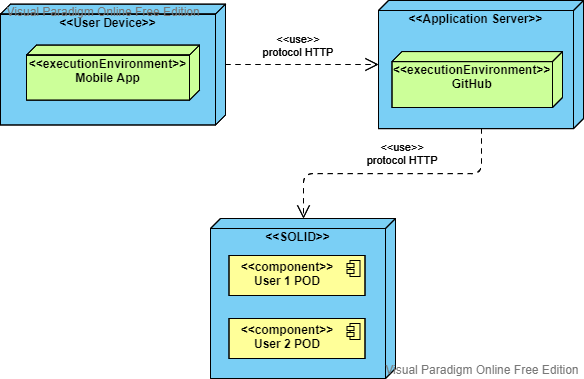

[[section-deployment-view]]

== Deployment View

=== Infrastructure Level 1

Motivation::

With this deployment structure the user can interact with the application in their phones, which must be conected to the Internet. This application will comunicate with the application server via the protocol HTTP, and the application server will comunicate with the SOLID server, so the users can access to their own data which is in their respective POD, or access the PODS of other users who have given them permission to do so.

With this design the users can interact with other users safely.

Quality and/or Performance Features::

In our application, we try to write the best possible code to maximize the quality and speed.

As this application is designed for mobile devices, it must be very fast.
In order to achieve this we will use some important coding rules like the DRY principle.

Mapping of Building Blocks to Infrastructure::
The main components of the infrastructure are:
|===
|Node|Description
| User Device | Is the device that the user will use for the application, it will usually be a mobile phone, but depending on the deployment of the project it could be also possible a computer.
| Mobile App | The application which would be intalled in the user's device.
| Application Server | Is the web hosting server where the application is allocated.
| GitHub | The web hosting server that we are going to use.
| SOLID | The SOLID server is where we are going to store the users's data securely in decentralized data stores, the PODS.
| User POD | The user POD is where their data is stored. Each user has their own POD and they can control who and what can access it.
|===
